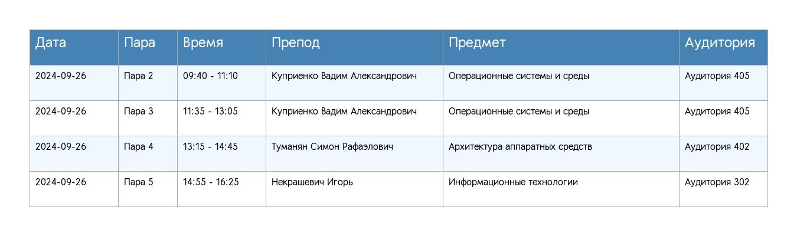

Этот проект представляет собой Telegram бота, который отправляет расписание с сайта колледжа Journal Top. Бот автоматически извлекает расписание на следующий день и отправляет его пользователям в виде изображения.

## Пример изображения расписания


## Установка

1. **Клонируйте репозиторий:**

   ```bash
   https://github.com/EugenePycharm/shedule.git
   ```

2. **Перейдите в директорию проекта:**

   ```bash
   cd shedule
   ```

3. **Установите необходимые библиотеки:**

   ```bash
   pip install requests pyTelegramBotAPI Pillow
   ```

## Использование

1. **Настройте токен бота:**
   - Замените токен в файле `main_bot.py` на ваш собственный токен, полученный от [BotFather](https://t.me/botfather).

2. **Укажите ID вашего чата:**
   - Замените `CHAT_ID` в `main_bot.py` на ваш собственный ID чата.

3. **Настройте данные для входа**
   - Замените данные для входа в файле `get_token.py` на ваши собственные данные от аккаунта на сайте [журнала](https://journal.top-academy.ru/)

4. **Запустите бота:**

   ```bash
   python main_bot.py
   ```

## Функциональность

- **Команда `/start`:** 
  - При запуске бота пользователю отправляется приветственное сообщение с предложением написать в чат "Расписание".

- **Получение расписания:**
  - Бот автоматически запрашивает расписание на следующий день и отправляет его в виде изображения.
  - Изображение создается с помощью функции `generate_schedule_image`, которая формирует таблицу с расписанием.

- **Закрепление сообщений:**
  - Бот закрепляет последнее отправленное сообщение с расписанием, открепляя предыдущее.

## Структура проекта

- `main_bot.py`: Основной файл бота, который обрабатывает команды и отправляет расписание.
- `get_token.py`: Файл для получения токена авторизации для доступа к API колледжа.
- `schedule_image.py`: Файл для генерации изображения расписания.

## Примечания

- Убедитесь, что у вас есть доступ к API колледжа для получения расписания.
- Проверьте, что все зависимости установлены и правильно настроены.

## Лицензия

Этот проект лицензирован под MIT License. 

---

Если у вас есть вопросы или предложения, не стесняйтесь обращаться!
